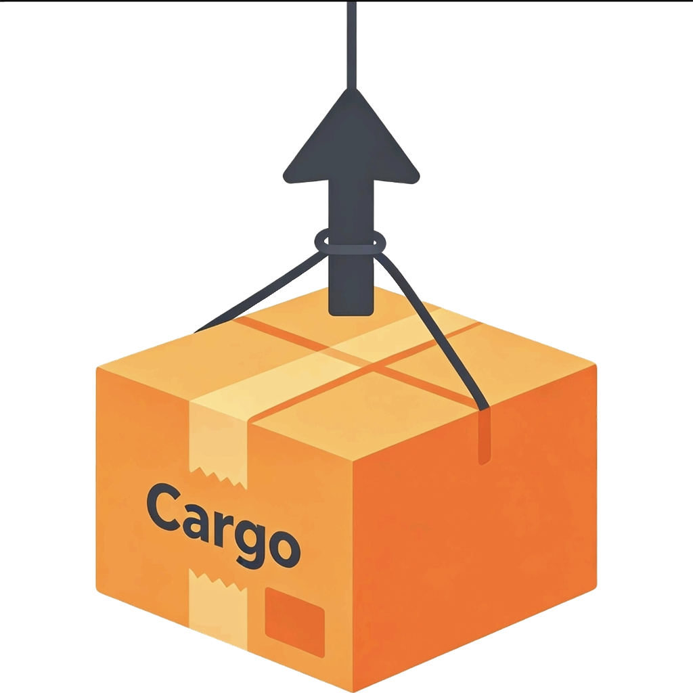

<div align="center">



# CargoRise

### Fast Rust project creation for Windows

**Lightweight, Fast & Portable Rust Project Launcher**

[](https://github.com/NostalgiaIm/CargoRise/releases)
[](https://www.microsoft.com/windows)
[](https://www.rust-lang.org/)
[](https://www.python.org/)

<br />

**[简体中文](README.zh-CN.md)** • **[English](README.md)**

<br />

</div>

CargoRise is a lightweight Windows tool for creating Rust projects and opening them in your IDE with less friction.

It is designed for RustRover, VS Code, and terminal-first workflows. After you finish a `main.rs`, CargoRise helps you create the next project faster and with fewer window switches.

> The English README is the primary project documentation. A Chinese translation is available in [README.zh-CN.md](README.zh-CN.md).

## Features

- Fast terminal command for creating a Rust project
- GUI window for project creation
- Optional automatic IDE launch after creation
- Support for RustRover and VS Code
- Remembered save path for repeated use
- Copy the current `main.rs` into the new project when needed
- Portable Windows release that can be placed on `PATH`

## Package Layout

```text
CargoRise/
  CargoRise.py
  CargoRise.pyw
  CargoRise.vbs
  cargorise.exe
  cargorise.cmd
  cargorise-new.cmd
  cargorise-open.cmd
  cargo_rise_core.exe
  backend/
  launcher/
  build_all.cmd
  install_windowsapps.cmd
  install_user_path.cmd
  install_powershell_profile.cmd
  assets/
    logo_dark.png
    CargoRise.ico
  README.zh-CN.md
```

## Quick Start

### 1. Fastest terminal workflow

```powershell
cargorise-new hello_world
```

Specify a save directory:

```powershell
cargorise-new hello_world C:\Projects\Rust
```

### 2. Open an existing project

```powershell
cargorise-open C:\Projects\Rust\hello_world
```

Force a specific IDE:

```powershell
cargorise-open C:\Projects\Rust\hello_world --ide vscode
cargorise-open C:\Projects\Rust\hello_world --ide rustrover
```

### 3. GUI mode

```powershell
cargorise
```

The window lets you enter:

- Project name
- Save path
- Whether to open the IDE after creation
- IDE mode: `auto`, `rustrover`, or `vscode`

## Installation

Recommended quick setup:

```powershell
.\install_windowsapps.cmd
```

If you prefer user PATH installation:

```powershell
.\install_user_path.cmd
```

If you use a PowerShell profile:

```powershell
.\install_powershell_profile.cmd
```

After installation, restart RustRover or VS Code, then test from a new terminal:

```powershell
where.exe cargorise
cargorise
```

## Notes

- `cargorise` is the GUI launcher.
- `cargorise-new` is the fastest create command.
- `cargorise-open` opens a project and can launch the IDE immediately.
- RustRover and VS Code usually do not need extra `.json` files in each project.
- If an IDE is not detected, make sure `rustrover` or `code` is available on `PATH`.

## Requirements

- Windows 10 / 11
- Python 3
- Rust toolchain and MinGW `windres` only if you want to rebuild the Windows launcher from source

## Build From Source

```powershell
.\build_all.cmd
```

This rebuilds:

```text
cargorise.exe
cargo_rise_core.exe
```

## Release Notes

- `v0.2.0`: Added `cargorise-open`, optional IDE launch after GUI creation, and a faster direct project skeleton generator.
- `v0.2.1`: Added the CargoRise project icon to the GUI window and embedded it into the Windows launcher executable. The Rust build script now handles icon embedding automatically.
